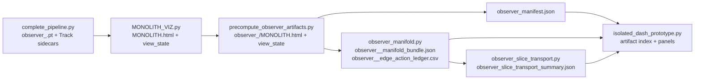

# Dash Observer Atlas Migration Plan - 2026-05-29

## Purpose

This branch isolates the Dash visualizer migration for the recent observer-recentering, action-graph, and observer-slice transport work. The target is not a cosmetic rewrite. The target is a new visual mode that lets a human see how a semantic path changes when it is transported between observer-conditioned manifolds.

The visual thesis is:

- A global manifold is one chart.
- Each observer-centered manifold is another chart.
- A path can move semantically within one chart or switch observer charts at a fixed article.
- If semantic movement and observer switching do not commute, the loop has holonomy. That is the "walking between dimensions and seeing how it distorts the path" effect.

## Current Dash Architecture

Dash currently has two separate layers that should remain separate.

1. Static MONOLITH renderer.
   Entry: `analysis/MONOLITH_VIZ.py`.
   Role: load run artifacts, build a Plotly HTML surface, emit `MONOLITH.html`, `MONOLITH.view_state.json`, `MONOLITH.focused_proof.json`, and `MONOLITH.run_manifest.json`.

2. Dash command center.
   Entry: `analysis/isolated_dash_prototype.py`.
   Role: index pre-rendered artifacts, route global/observer HTML into an iframe, hydrate sidecar JSON/CSV contracts, and render control/provenance/relativity panels.

The safe design is artifact-first: PyTorch and expensive recomputation stay upstream. Dash callbacks should load JSON/CSV/NPZ sidecars and should not run tensor recomputation.

## Current Artifact DAG

The relevant pipeline is:



This is the migration seam. Add atlas artifacts between observer precompute and Dash consumption; do not make Dash rediscover tensors live.

## Existing Components To Preserve

- `observer_manifest.json` already tells Dash which observer artifacts exist and where their view-state files live.
- `observer_<idx>_manifold_bundle.json` already represents global coordinates, translation-null coordinates, observer coordinates, non-translation shift, density, stress, terrain zone, labels, and observer path edges.
- `observer_<idx>_edge_action_ledger.csv` already turns existing focused observer paths into an edge/action ledger.
- `observer_slice_transport_summary.json` already represents the commutator/holonomy route records.
- Existing Track 4 cyclic walker artifacts are a different contract and should not be renamed into observer holonomy.
- Existing MONOLITH observer iframe mode should continue working exactly as it does now.

## Missing Visualization Contract

`observer_slice_transport_summary.json` is sufficient for a metric readout, but not sufficient for spatial rendering. It stores route IDs and actions, not the per-corner coordinates needed to draw the loop.

Add a new additive artifact:

`observer_atlas_bundle.json`

Required shape:

```json
{
  "schema_version": 1,
  "bundle_type": "observer_atlas_bundle",
  "run_dir": "...",
  "created_at": "...",
  "source_artifacts": {
    "observer_manifest": "observer_manifest.json",
    "observer_manifold_bundles": ["observer_0_manifold_bundle.json"],
    "observer_slice_transport_summary": "observer_slice_transport_summary.json",
    "fingerprints": {
      "observer_manifest.json": {"size": 1234, "mtime_ns": 0, "sha256": "..."},
      "observer_0_manifold_bundle.json": {"size": 1234, "mtime_ns": 0, "sha256": "..."},
      "observer_slice_transport_summary.json": {"size": 1234, "mtime_ns": 0, "sha256": "..."}
    }
  },
  "coordinate_frame": "observer_xyz",
  "slices": [
    {
      "slice_id": "global",
      "label": "Global",
      "nodes": [
        {
          "row_index": 0,
          "article_idx": 13,
          "x": 0.0,
          "y": 0.0,
          "z": 0.0,
          "zone": "Bridge",
          "density": 0.92,
          "stress": 0.12,
          "label": "article label"
        }
      ]
    }
  ],
  "routes": [
    {
      "source_row_index": 1,
      "target_row_index": 2,
      "source_article_idx": 101,
      "target_article_idx": 205,
      "source_slice": "global",
      "target_slice": "observer_13",
      "semantic_first": {
        "action": 1.2,
        "points": [[0, 0, 0], [1, 0, 0], [1, 1, 0]]
      },
      "observer_first": {
        "action": 0.7,
        "points": [[0, 0, 0], [0, 1, 0], [1, 1, 0]]
      },
      "null_holonomy_action": 0.0,
      "excess_holonomy_action": 0.5,
      "relative_holonomy": 0.42
    }
  ],
  "metrics": {
    "record_count": 4,
    "mean_holonomy_action": 1.5,
    "mean_null_holonomy_action": 0.0,
    "mean_excess_holonomy_action": 1.5
  }
}
```

The summary artifact remains analytical. The atlas bundle becomes the Dash rendering payload.

Important index rule: `observer_slice_transport.py` operates on array positions, while Dash commonly names selected articles as `article:N`. The Atlas bundle must preserve both `row_index` and `article_idx` for every node and route. Dash should display `article_idx`, but route reconstruction should use `row_index` unless a bundle explicitly declares contiguous identity between the two.

## Visual Grammar

The Atlas mode should show only enough at once for the user to understand the geometry.

- Global sheet: subdued terrain scaffold.
- Active source slice: solid observer-colored sheet or points.
- Active target slice: translucent/wireframe ghost sheet.
- Article identity columns: thin vertical/diagonal connectors joining the same article across slices.
- Semantic-first path: one high-contrast color, e.g. warm amber.
- Observer-first path: contrasting color, e.g. cyan.
- Holonomy membrane: translucent ribbon connecting the two routes; thickness/opacity driven by `excess_holonomy_action`.
- Null route: optional dashed gray overlay, hidden by default but available as a control.
- Terrain zones: badges/tooltips only; avoid painting four full terrain surfaces on top of each other.

The instant read should be:

- "These are the same article nodes seen from different observer charts."
- "The two possible orders of travel are not equivalent."
- "The gap between the routes is the evidence, not decoration."

## Dash Integration Plan

### Phase 1: Index And Gate Atlas Artifacts

Files:

- `analysis/verification/contract.py`
- `analysis/isolated_dash_prototype.py`
- `test_dash_contract_schema.py`
- `test_dash_contract_gating_diagnostics.py`

Add optional artifacts:

- `observer_atlas_bundle.json`
- `observer_slice_transport_summary.json`
- `observer_<idx>_manifold_bundle.json`
- `observer_<idx>_edge_action_ledger.csv`

Rules:

- Missing Atlas artifacts must disable Atlas mode honestly.
- Global verification is not sufficient for Atlas verification.
- Atlas readiness must be reported through a separate Atlas gate/status. Missing or stale Atlas artifacts must not make the normal global/observer Dash dashboard fail.
- Observer mismatch, stale bundle, missing coordinate frame, or synthetic placeholder data must not silently fall back to global MONOLITH.
- Atlas staleness must be checked against source fingerprints or, at minimum, source path, size, and `mtime_ns` for the observer manifest, observer manifold bundles, transport summary, and run identity.
- Atlas generation must require real focused observer artifacts. Manifest entries whose action is only `link`/`copy` from global MONOLITH output cannot be treated as valid observer slices for holonomy display.

### Phase 2: Build Atlas Bundle Upstream

Files:

- `core/observer_manifold.py`
- `core/observer_slice_transport.py`
- new helper module, likely `core/observer_atlas_bundle.py`
- `analysis/regression/precompute_observer_artifacts.py`
- tests in `test_observer_manifold_bundle.py` or new `test_observer_atlas_bundle.py`

Implementation:

- Read global + observer manifold bundles.
- Convert selected coordinate frame into slice nodes.
- Join slice transport records to concrete route coordinates.
- Store both `row_index` and `article_idx` to prevent non-contiguous article IDs from being interpreted as array positions.
- Add null-calibrated fields when `null_records` exist.
- Add source provenance fingerprints so Dash can detect stale Atlas bundles.
- Write one run-level `observer_atlas_bundle.json`.

Do not mutate old bundle schemas except additively.

### Phase 3: Add Dash Atlas Panel

Files:

- `analysis/isolated_dash_prototype.py`
- `test_dash_contract_schema.py`
- `test_dash_verification_gates.py`

Lowest-risk path:

- Add an `atlas-panel` near the existing relativity/group/empathy panels.
- Initially show an evidence card plus a small abstract route graph.
- Avoid adding a new callback output until tests are updated, because the main dashboard callback has a long positional output tuple.

Second step:

- Add `view_mode="atlas"` once route parsing and callback outputs are tested.
- Atlas mode should mount a Dash `dcc.Graph`, not the static MONOLITH iframe.

### Phase 4: Add Plotly Atlas Figure

Files:

- new helper module, likely `analysis/observer_atlas_viz.py`
- `analysis/isolated_dash_prototype.py`
- optional later hook in `analysis/MONOLITH_VIZ.py`

Trace plan:

- `Scatter3d` nodes per slice.
- `Scatter3d` identity connectors for selected articles.
- `Scatter3d` route line for semantic-first route.
- `Scatter3d` route line for observer-first route.
- `Mesh3d` or filled line strips for holonomy ribbon/membrane.
- Optional null route as dashed gray line.

Performance controls:

- Default to top `N` holonomy records by `excess_holonomy_action`.
- Cap rendered nodes unless user explicitly expands.
- Use `uirevision` so observer switching does not reset camera unnecessarily.
- Render path layers by default, but keep labels minimal and hover-driven.

### Phase 5: Static MONOLITH Overlay

Files:

- `analysis/MONOLITH_VIZ.py`
- `test_monolith_viz_runtime_regressions.py`

Only after Dash Atlas mode works:

- Add optional atlas traces near existing phantom/hysteresis/highway render helpers.
- Keep old Track 4 cyclic paths untouched.
- Store atlas summary in `MONOLITH.view_state.json` as additive metadata.

## Tests To Add

- Atlas bundle schema includes `bundle_type`, `schema_version`, `slices`, `routes`, `metrics`, and finite coordinates.
- Atlas bundle rejects missing or mismatched observer coordinate frames.
- Atlas bundle preserves both row positions and article IDs, and tests non-contiguous article IDs.
- Atlas bundle provenance/fingerprint changes when source artifacts change.
- Atlas generation rejects observer manifest entries that reuse global MONOLITH output instead of focused observer artifacts.
- Atlas bundle joins `observer_slice_transport_summary.json` records to route coordinates.
- Dash discovers Atlas artifacts and exposes Atlas-ready status.
- Dash disables Atlas mode when Atlas artifacts are absent, stale, synthetic, wrong observer, or missing route coordinates.
- Dash Atlas status is separate from normal dashboard verification, so missing Atlas does not fail the existing global/observer views.
- Dash `view_mode="atlas"` mounts a graph/panel and does not silently fall back to `MONOLITH.html`.
- Dash handles multiple observer slices without conflating `article:N` selections.
- Existing observer iframe mode still passes.
- Existing MONOLITH path replay tests still pass.

Suggested scoped command:

```powershell
pytest -q test_dash_contract_schema.py test_dash_contract_gating_diagnostics.py test_dash_verification_gates.py test_monolith_viz_runtime_regressions.py test_observer_manifold_bundle.py test_observer_recenter_meaning_probe.py test_observer_recenter_robustness_suite.py test_track4_action_graph.py
```

## What Not To Do

- Do not recompute PyTorch tensors inside Dash callbacks.
- Do not replace MONOLITH iframe rendering with Atlas in the first pass.
- Do not rename cyclic walker paths as holonomy paths.
- Do not use global artifacts as fallback for observer-specific Atlas artifacts.
- Do not render every observer sheet fully opaque at once.
- Do not treat source labels as ground truth ideological labels for real corpora.

## Acceptance Criteria

- The branch can show a run where global, source observer, and target observer slices are distinct.
- The same article can be visually connected across observer charts.
- Semantic-first and observer-first routes are visibly different when holonomy exists.
- Null-calibrated/excess holonomy is shown as evidence, not just visual effect.
- Existing Dash global/observer iframe workflows continue to pass tests.
- Atlas mode fails closed when required artifacts are missing.
